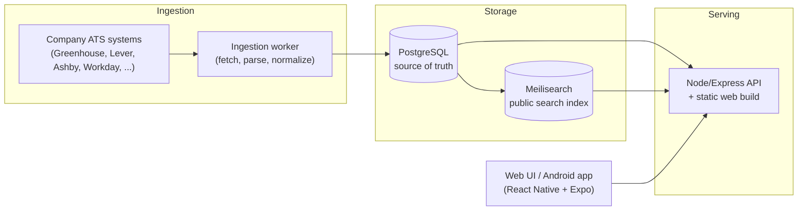

# OpenJobSlots

**Fresh jobs, straight from the source.**

OpenJobSlots is an open-source job aggregator that ingests postings **directly from company ATS systems** — no scraping of stale job boards, no third-party middlemen. It maintains a large registry of ATS providers (Greenhouse, Lever, Ashby, Workday, SmartRecruiters, Workable, and many more), normalizes every posting into a single schema, and serves fast, typo-tolerant search through a clean web and mobile UI.

**Live site:** [https://openjobslots.com](https://openjobslots.com)

## Features

- **Direct ATS ingestion** — jobs are pulled from company career systems at the source, so listings are fresh and links go straight to the real application page.
- **Large ATS registry** — adapters for dozens of ATS providers, with a certification pipeline that tracks parser quality per source.
- **Fast search** — Meilisearch-backed, typo-tolerant full-text search with filters for title, company, location, country/region, remote mode, and ATS source.
- **Normalized posting schema** — every job, regardless of origin, is mapped to one consistent shape (title, company, location, remote status, posting date, apply URL).
- **Application tracking** — mark postings as applied, ignored, or blocked; track statuses like *interview scheduled* and *offer received*.
- **Quality tooling** — built-in audits for data quality, source freshness, ATS health, and search-index parity between Postgres and Meilisearch.
- **Multi-platform frontend** — a single React Native/Expo codebase serving web and Android.

## Architecture



Four services run in production, all defined in `docker-compose.yml`:

| Service | Role |
|---|---|
| `openjobslots-app` | Node/Express API + built web frontend |
| `openjobslots-worker` | ATS ingestion worker (sync, parsing, maintenance) |
| `openjobslots-postgres` | Source-of-truth database |
| `openjobslots-meilisearch` | Public search index |

## Tech stack

- **Backend:** Node.js, Express, pg-boss (job queue)
- **Database:** PostgreSQL 16 (SQLite retained for local fallback and isolated tests)
- **Search:** Meilisearch
- **Frontend:** React Native + Expo (web via `react-native-web`, Android builds via EAS)
- **Testing:** Playwright (API + E2E), node-based unit tests, quality gates
- **Infra:** Docker + Docker Compose

## Quick start (Docker Compose)

Prerequisites: Docker and Docker Compose.

```bash
git clone https://github.com/batuhanboran/openjobslots.git
cd openjobslots

# Required environment variables
export OPENJOBSLOTS_POSTGRES_PASSWORD=<choose-a-strong-password>
export MEILI_MASTER_KEY=<choose-a-strong-key>
export OPENJOBSLOTS_ADMIN_TOKEN=<choose-a-strong-token>

docker compose up -d --build
```

The web UI and API are served on `http://localhost:8081`. The ingestion worker starts syncing ATS sources automatically.

| Variable | Purpose |
|---|---|
| `OPENJOBSLOTS_POSTGRES_PASSWORD` | Postgres password (required — compose refuses to start without it) |
| `MEILI_MASTER_KEY` | Meilisearch master key (required) |
| `OPENJOBSLOTS_ADMIN_TOKEN` | Token protecting admin/control API routes |
| `OPENJOBSLOTS_PROXIES` | Optional comma-separated `host:port:user:pass` outbound proxy pool for ingestion (empty = direct fetch) |

Many more knobs (rate limits, ingestion budgets, memory limits) are exposed as optional env vars — see `docker-compose.yml` for the full list with defaults.

### Local development (without Docker)

```bash
npm install
npm run server   # API on http://localhost:8787
npm run web      # Expo web UI on http://localhost:8081
```

Run the ingestion worker locally only if you intentionally want local sync behavior:

```bash
npm run ingestion:worker
```

## Project structure

```
.
├── App.js                 # React Native/Expo app entry (web + Android UI)
├── src/                   # Shared frontend logic (API client, filters, SEO, analytics)
├── server/
│   ├── index.js           # Express API entry point
│   ├── ingestion/         # ATS adapters, parsers, worker, source registry
│   ├── search/            # Meilisearch integration + search config
│   ├── backends/          # Postgres store
│   ├── http/              # Route registration, serializers, security
│   ├── queue/             # pg-boss job queue
│   └── state/             # SQLite app state (local/fallback)
├── scripts/               # Audits, backfills, migrations, ATS tooling
├── docs/                  # Runbooks and reference docs
│   └── reference/         # Ingestion, search quality, ATS adapter matrix, QA
├── tests/                 # Playwright API + E2E tests
├── docker-compose.yml     # Full production-like stack
└── Dockerfile
```

## Useful commands

```bash
npm run test:backend            # Backend unit tests
npm run test:parsers            # ATS parser tests
npm run test:e2e                # Playwright end-to-end tests
npm run quality:gate            # Aggregate quality gate
npm run audit:ats-quality       # Per-ATS data quality audit
npm run search:parity           # Postgres <-> Meilisearch parity check
```

## Contributing

PRs and issues are welcome — bug fixes, new ATS adapters, and search-quality improvements are especially appreciated. Please note:

- New ATS adapters go through a certification pipeline (see `docs/reference/ats-source-certification.md`) before they ship.
- **Deployments are owner-gated.** Merging a PR does not deploy it; releases to [openjobslots.com](https://openjobslots.com) are performed by the maintainer.

Before opening a PR, run the relevant test suites above and `npm run quality:gate`.

## License

Released under the [MIT License](LICENSE).
